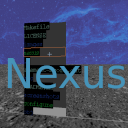
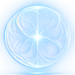
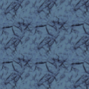
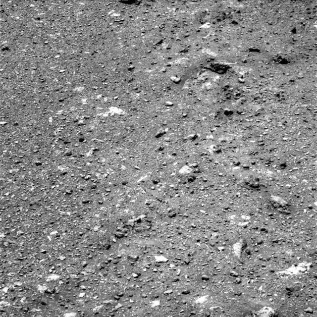
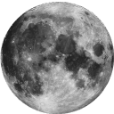
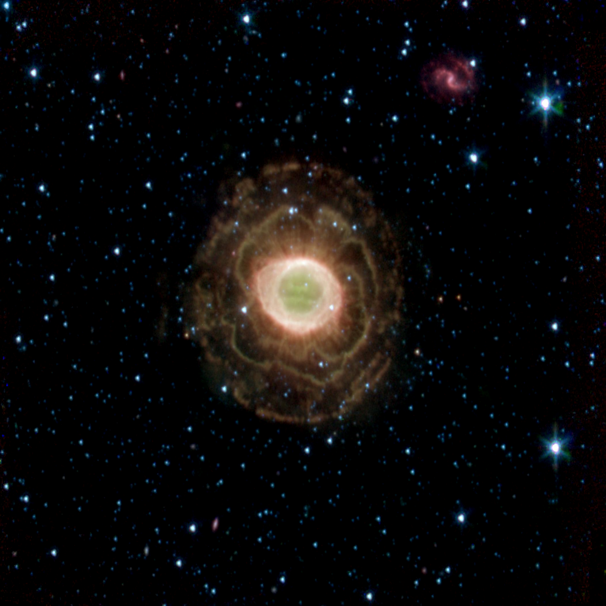
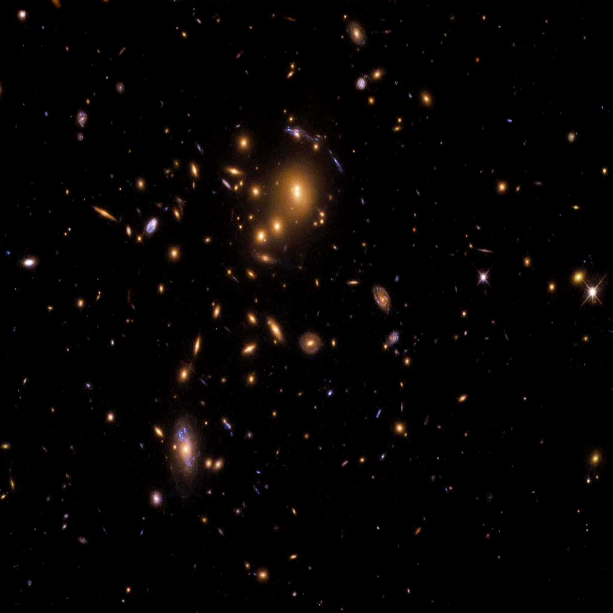
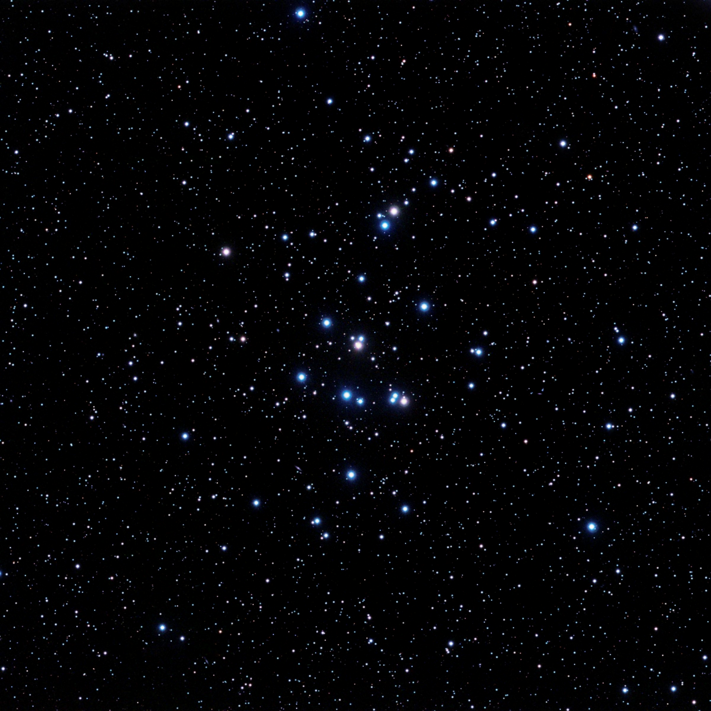

# Images

---

Note: All NASA images have been slightly modified to fit correct rendering.
The other textures have been created using the Gimp image editor.

---

  
*nexus-logo.png*  

---

  
*element-battery-128a.png*  

---

  
*element-iron-128.png*  

---

  
*element-magnet-128.png*  

---

  
*element-rock-128.png*  

---

  
*element-wood-128.png*  

---

  
*flag01-128.png*  

---

  
*floor01-640.png*  
Credits: NASA https://images-assets.nasa.gov/image/PIA14533/PIA14533~thumb.jpg  

---

  
*font-760x16a.png*  

---

  
*moon01-128ga.png*  
Credits: NASA https://www.jpl.nasa.gov/images/pia00405-earths-moon  

---

  
*sky01-2048.png*  
Credits: NASA/JPL-Caltech https://images-assets.nasa.gov/image/PIA15415/PIA15415~orig.jpg  

---

  
*sky02-2048.png*  
Credits: NASA/JPL-Caltech/Harvard-Smithsonian CfA https://images-assets.nasa.gov/image/PIA07343/PIA07343~orig.jpg  

---

  
*sky03-2048.png*  
Credits: NASA https://images-assets.nasa.gov/image/potw1844a/potw1844a~orig.jpg  

---

  
*sky04-2048.png*  
Credits: NASA/Stuart Heggie https://images-assets.nasa.gov/image/PIA15801/PIA15801~orig.jpg  
